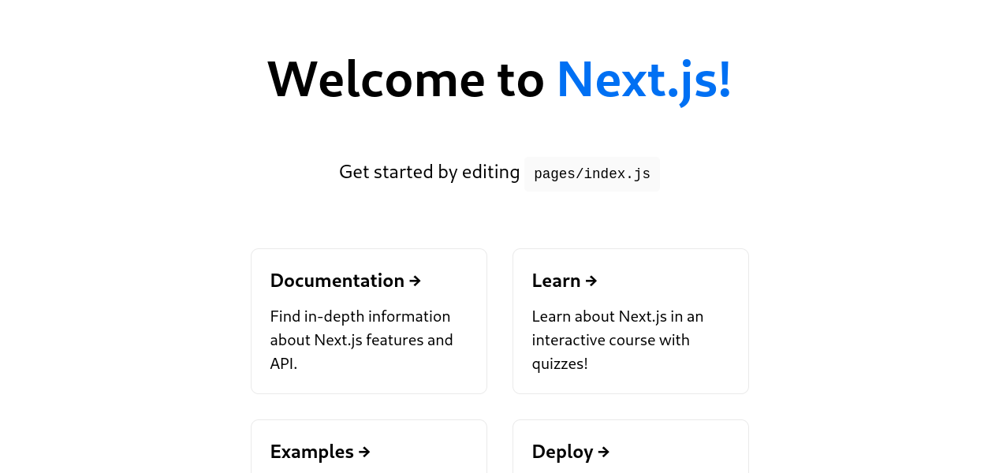
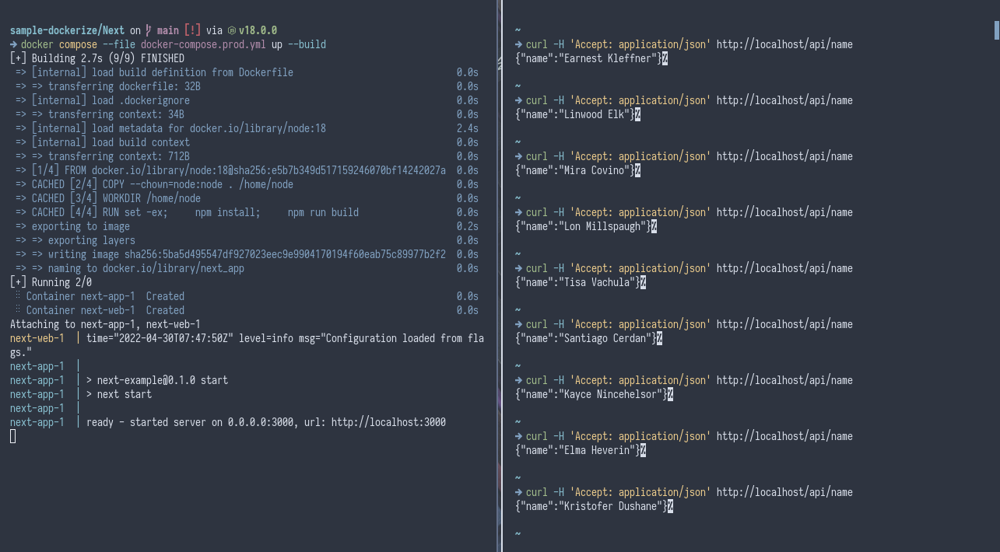

# Example Next.js Docker

This is a hello world app that is written in Javascript using [Next.js](https://nextjs.org/) framework, packaged using [Docker](https://www.docker.com/).

## Generating Next.js Apps

Next.js uses [Node.js](https://nodejs.org/) to transpile the source code into Javascript code that can run in client's web browser and to run server-side code. Make sure to have Node.js installed and its package manager, `npm`.

Then execute the `create-react-app` script to bootstrap a starter Next app.

```
npx create-next-app project-name
```

## Packaging

This is packaged by using the [Node.js container image](https://hub.docker.com/_/node) as a base, copying the source code and installs necessary dependencies of this app, and transpile the source code into static files that can be deployed into any webservers. Unlike React, Next.js can have a component that is running on the server side so we'll keep the Node.js runtime in the container.

## Running

### Development

```
docker compose up --build
```

### Production

```
docker compose --file docker-compose.prod.yml up --build
```

## Customizing

Docker images can be customized using environment variables or customized during build time using build arguments.

### Environment Variables

No environment variables available.

### Build Arguments

| Key | Description |
| --- | --- |
| `NODE_VERSION` | The version of Node.js that will be used for building this image. |

## Screenshots


